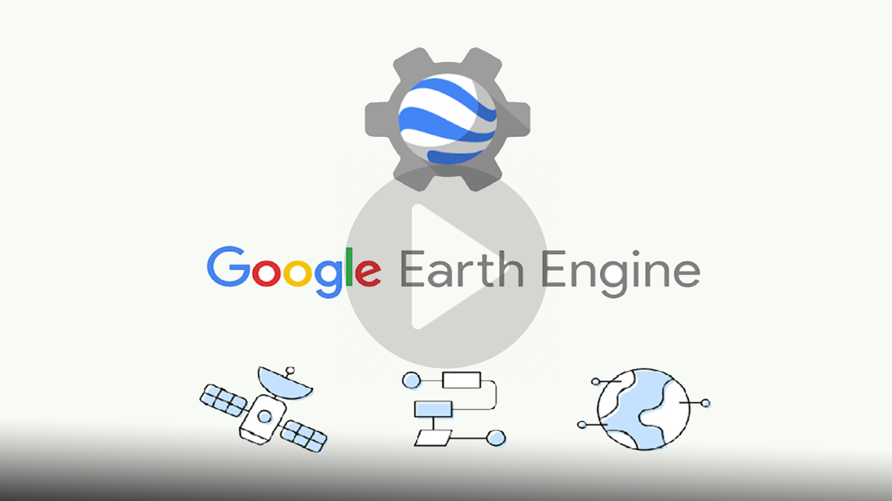

# Welcome to Google Earth Engine Training 

## Introduction

Google Earth Engine is a cloud-based platform that enables large-scale processing of satellite imagery to detect changes, map trends, and quantify differences on the Earth’s surface. This course covers the full range of topics in Earth Engine to give the participants practical skills to master the platform and implement their remote sensing projects.

 

## Objectives

The main objective is to train GIS and Remote Sensing Experts on the SCAFS project in the basics of satellite image
processing in the [Google Earth Engine (GEE)](https://earthengine.google.com/) Environment by leveraging on the Google Earth
high-resolution imagery and the GEE cloud-based data processing capacities for land use
mapping, spatiotemporal analysis on forest monitoring and cartographic visualization.

1. Introduce the Continuous Change Detection and Classification (CCDC) model
2. Work through application examples
3. Facilitate a dissemination workshop on the map outputs

	
## Sign-up for Google Earth Engine

- If you already have a Google Earth Engine account, you can skip this step.
- Visit https://signup.earthengine.google.com/ and sign-up with your Google account. You can use your existing gmail account to sign-up. It usually takes 1-2 days 	  for approval. Hence do this step as soon as possible.

Tips to ensure smooth sign-up process:

- Use Google Chrome browser.
- When signing up for Earth Engine, please log out of all Google accounts and ensure you are logged into only 1 account which you want associated with Earth Engine.

### [Workshop  - Google Earth Engine Training ]()

#### Day 1  Introduction to Google Earth Engine (GEE)
##### [Module 1 - Basics to Earth Engine  and Github](https://github.com/ernest19/SNV/blob/main/training/modules/module1.md)
- Introduction to Remote Sensing
- Introduction to GEE code editor
- Introduction to JavaScript
- GEE objects, strings, lists ,Arrays
- Interaction  to GIThub   interface 

#### Day 2 Data exploration using GEE
##### [Module 2 - ImageCollections and FeatureCollections ](https://github.com/ernest19/SNV/blob/main/training/modules/module2.md)
- Introduction to the concept of image and feature collections in GEE
- Filtering, reducing, mosaicking, cloud masking,clipping  and working with image collections
- Accessing and displaying satellite imagery through the GEE Code Editor
- Asset management (importing and exporting data)
- Hands-on exercises

##### [Module 3 - Exploring Spatial Indices and GEE Products](https://github.com/ernest19/SNV/blob/main/training/modules/module3.md)
- Exploring spectral indices (NDVI,NDBI,LSWI,TC-G,TC-B,TC-W)
- Forest/Deforestation monitoring with data exploration(Introduction to Global Forest Change datasets)
- Hands-on exercise

#### Day 3  Remote Sensing Applications in GEE, PART I
##### [Module 4 -  Time Series](https://github.com/ernest19/SNV/blob/main/training/modules/module4.md)
- Introduction to time series analysis
- Time-Series Charts
- Charting and creating custom UIs
- Publishing an App in GEE
- Hands-on exercises

#### Day 4 Remote Sensing Applications in GEE, PART II

##### [Module 5 - Machine Learning Classification Algorithms](https://github.com/ernest19/SNV/blob/main/training/modules/module5.md)
- Introduction to Machine Learning  and Classification
- Introduction to change detection
- Supervised classification and sampling
- Unsupervised Classification and segmentation
- Accuracy assessment in GEE
- Random Forest Classification for land change assessment
- Hands-on exercise

#### Day 5  Hands - on Application in GEE
##### [Module 6 -Land Use Land Cover Change Analysis ](https://github.com/ernest19/SNV/blob/main/training/modules/module6.md)
- Land cover and land use cover change analysis
- Create 2018 and 2020 land cover maps of the emission reduction programme area
- Map generation 
- Wrap up

